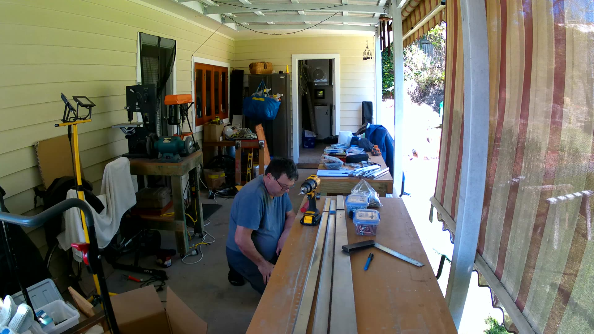
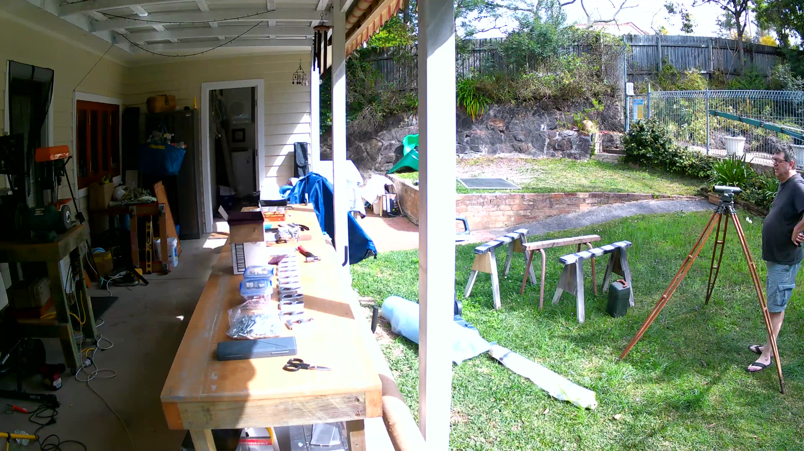
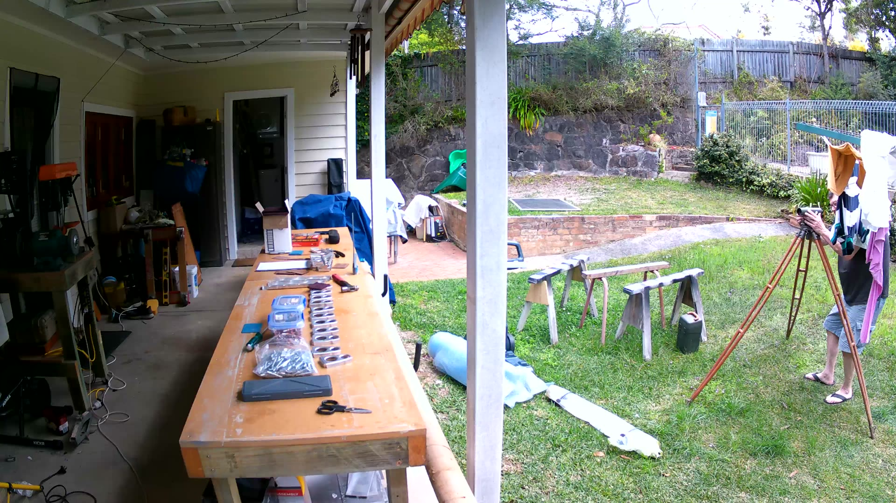
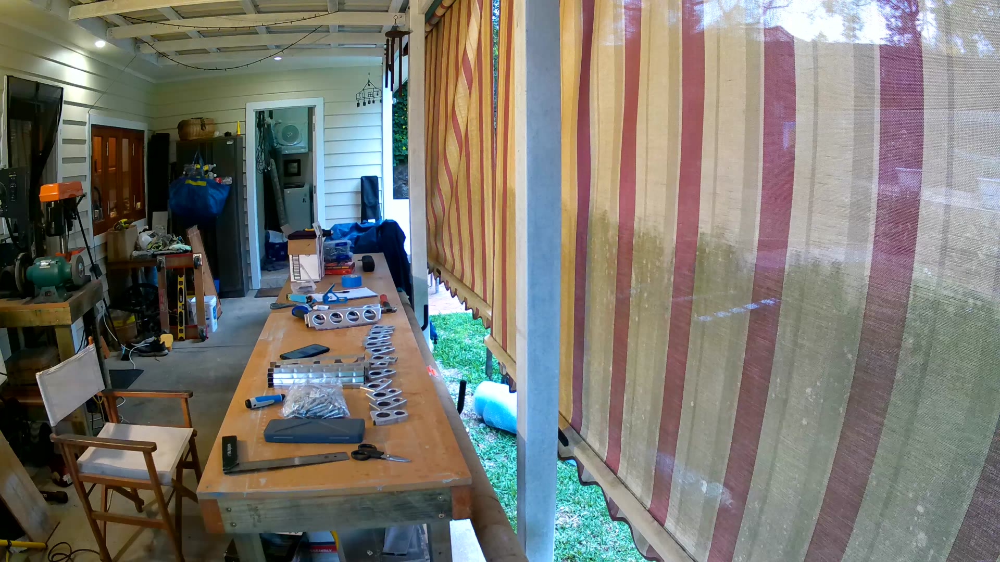
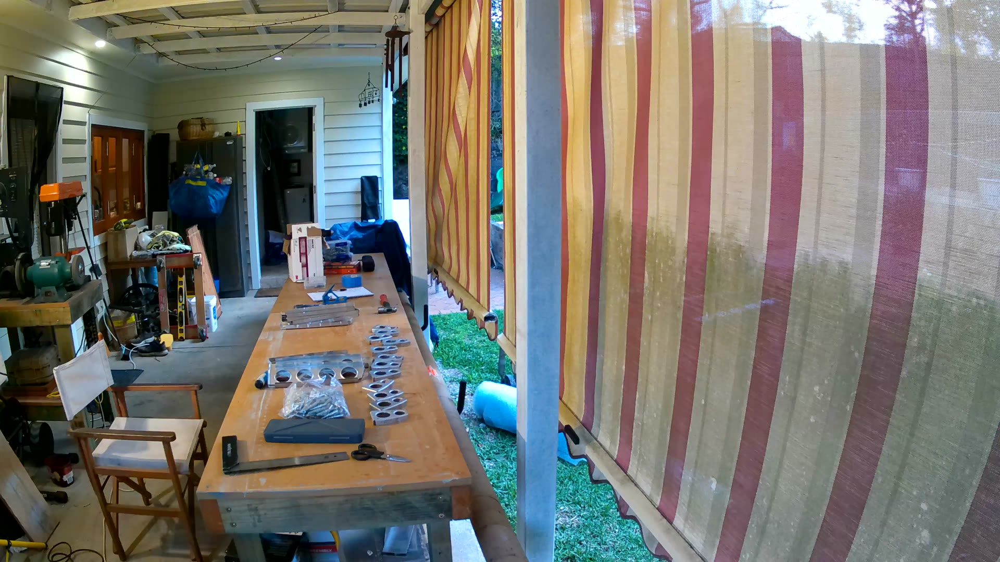
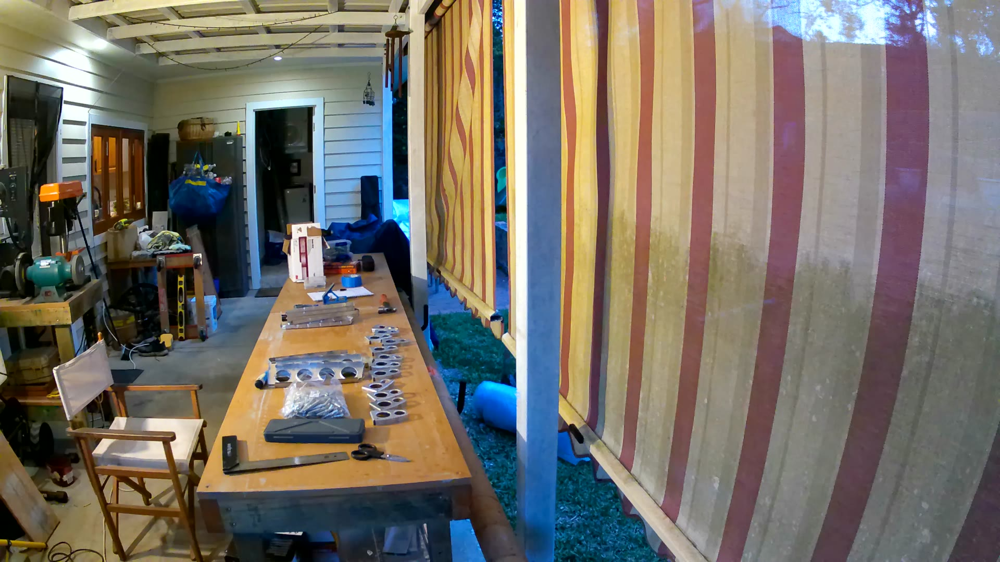
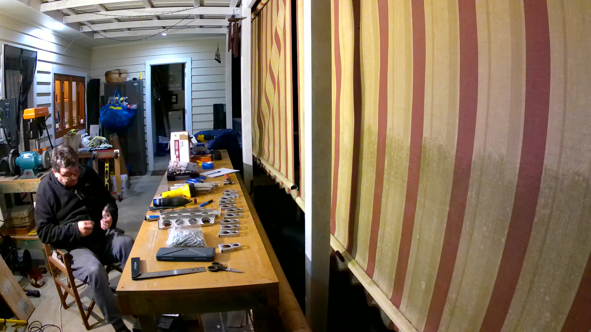
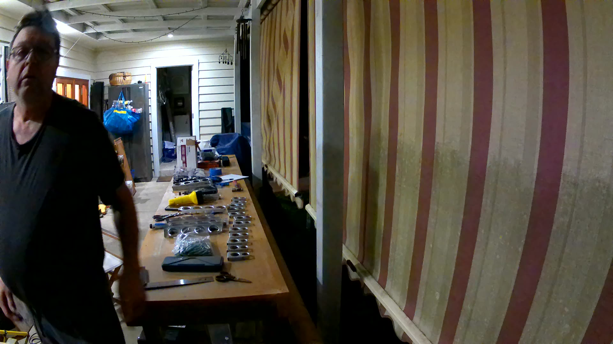

# Glastar Kit #5445 — Builder's Log

**Builder:** Peter Lovenfosse  
**Kit:** Stoddard-Hamilton Glastar  
**Kit Number:** #5445  
**Location:** Asquith, NSW, Australia  
**Build Commenced:** 2026  

> This log is maintained as evidence of amateur construction in accordance with  
> CASA requirements for the Experimental Amateur-Built category.  
> All work described was performed by the registered builder unless otherwise noted.

---

## How to Read This Log

Each entry records a build session. Entries include:
- Date and time invested
- Section of the aircraft being worked on
- Tasks performed by the builder
- Any assistance received (to demonstrate builder majority)
- Photographic evidence

---

## Build Sessions

---

### 2026-05-26

**Section:** Pre-Build / Setup  
**Time Spent:** —  
**Builder:** Peter  

**Work Performed:**
- All tools required for Section III (Rudder Assembly) assembled and confirmed ready.
- Currently completing a Vans Aircraft practice kit to develop riveting technique prior to commencing Glastar construction.
- Build log established. AI build assistant (Wilbur) configured to assist with documentation.

**Assistance Received:** None — tools assembled by builder.

**Photos:** —

---

### 2026-06 to 2026-09-06

**Section:** Pre-Build / Practice Kit (Vans Aircraft)
**Time Spent:** Multiple sessions
**Builder:** Peter

**Work Performed:**
- Test fitted all practice kit components.
- Deburred all parts.
- Primed all parts using Stewart Systems EcoPrime waterborne primer.
- Back riveted skin stiffeners to skin.

**Current Status:** Work paused pending parts. Pneumatic rivet squeezer requires a replacement part (~$10), currently on order. Expected arrival approximately 20 October 2026. Will resume riveting once part arrives.

**Assistance Received:** None — all work performed by builder.

**Photos:** —

---

### 2026-09-06

**Section:** Section III — Rudder Assembly (Inspection & Remediation)
**Time Spent:** Multiple sessions
**Builder:** Peter

**Work Performed:**

**Rudder Parts Inspection**
Located and examined all rudder parts. The rudder is Section III of the build manual — the first assembly tackled — and the previous kit owner (Kit #5445) had made a start. He had assembled the components and match drilled all spar and rib flanges using the factory holes as guides. The parts were then left on the bench for approximately 20 years.

**Chrome Moly Yoke Weldment — Restoration**
The rudder yoke weldment (chrome moly steel) had powder coating lifting along the edges of the attachment flange. Moisture had penetrated beneath the powder coating in this area, causing very light surface rust. All powder coating was stripped from the weldment and it was soaked in an Evapo-Rust bath for approximately 24 hours. Close inspection after treatment confirmed no pitting — the metal surface was in excellent condition beneath the rust. Remediation steps:
- Stripped all powder coating from the weldment.
- Soaked in Evapo-Rust bath for approximately 24 hours.
- Close inspection confirmed very light surface rust only — no pitting.
- Primed with 2K Epoxy Primer.
- Top coated with 2K Epoxy Top Coat.
- Replaced the small ball bearing in the bottom of the yoke.

The weldment is now in excellent condition.

**Spars and Ribs — Inspection**
All rudder spars and ribs inspected. With the exception of the aft rudder spar (see below), all parts are in acceptable condition and will be usable.

**Aft Rudder Spar — Replacement Required**
The aft rudder spar cannot be used. The previous builder failed to align the centreline marked on the flanges with the factory holes in the rudder skin before drilling. The holes were drilled significantly off the correct line, rendering the part unairworthy. The part cannot be corrected — replacement is required.

Sourcing:
- Contacted Glasair Aviation — no result.
- Posted on Glasair Owners forums — no result.
- Engaged a GA repair/fabrication shop in Sydney to manufacture a replacement spar. Part fabrication arranged.

**Current Status:** Awaiting delivery of the fabricated aft rudder spar replacement. All other rudder parts ready to proceed once spar is in hand.

**Assistance Received:** None — all inspection and restoration work performed by builder. Aft rudder spar replacement to be manufactured by a GA repair shop (noted as outside fabrication; builder will perform all assembly).

**Photos:** —

---

### 2026-09-06 — Horizontal Stabilizer commencement

**Section:** Horizontal Stabilizer — Initial Inspection
**Time Spent:** —
**Builder:** Peter

**Decision: Horizontal Stabilizer First**
Following advice from experienced builders on the forums, elected to commence the Horizontal Stabilizer assembly before returning to the Rudder. Although larger, the Horizontal Stabilizer is less complex than the Rudder and considered a better first assembly to develop technique. The Rudder parts have been stored safely while awaiting the fabricated aft spar replacement and the rivet squeezer part.

**Horizontal Stabilizer Parts Inspection**
All Horizontal Stabilizer parts located and closely inspected. Findings:
- All parts in pristine condition.
- Most components still sealed in original factory blister packs.
- Spars never removed from their original packaging.
- Skins showed some edge deterioration, however the factory protective plastic film is still intact and peels cleanly when warmed with a heat gun.

Overall: all Horizontal Stabilizer parts are in excellent condition and ready to proceed.

**Current Status:** Horizontal Stabilizer inspection complete. All parts accounted for and serviceable. Ready to commence prep work.

**Assistance Received:** None — all inspection performed by builder.

**Photos:** —

---

### 2026-09-06 — Horizontal Stabilizer skin preparation

**Section:** Horizontal Stabilizer — Skin Preparation
**Time Spent:** 1 evening session
**Builder:** Peter

**Work Performed:**

**Protective Film Removal (Rivet Line Areas)**
Used a soldering iron to score and cut strips in the protective plastic film along the rivet hole lines. Strips were then peeled away, exposing the rivet hole areas while leaving the remaining film in place to protect the rest of the skin surface.

**Rivet Line Cleaning**
Cleaned all exposed rivet hole lines using maroon Scotchbrite pads with WD-40. Light corrosion was present in places along the skin edges and around some rivet holes, consistent with moisture ingress beneath the protective film over time. All affected areas cleaned back to bare metal — now looking as new.

**Previous Owner Primer Removal**
The original kit owner had applied primer to the inside faces of the skins. This was removed using acetone and paper towels. Skins will be correctly primed with Stewart Systems EcoPrime immediately prior to final assembly.

**Current Status:** Skins clean, corrosion-free, and ready for further preparation. EcoPrime priming to be completed just before final assembly.

**Assistance Received:** None — all work performed by builder.

**Photos:** —

---

### 2026-09-07 — Horizontal Stabilizer skin storage & rib unpack

**Section:** Horizontal Stabilizer — Parts Preparation
**Time Spent:** 11:00–13:00 (2 hours)
**Builder:** Peter

**Work Performed:**

**Horizontal Stabilizer Skins — Finalised and Stored**
Completed cleanup of the Horizontal Stabilizer skins. Skins are now clean, corrosion-free and stored safely, ready for priming immediately prior to final assembly.

**Horizontal Stabilizer Ribs — Unpacked**
Removed all Horizontal Stabilizer ribs from their blister packs. All ribs inspected visually and look to be in excellent condition. Next step is to verify each rib is flat and that the flanges are square to the webs before proceeding to prep work.

**Assistance Received:** None — all work performed by builder.

**Photos:** —

---

### 2026-09-07 — Equipment received

**Section:** Workshop / Equipment
**Time Spent:** —
**Builder:** Peter

**Equipment Received:**

- **Camera:** Kogan 4K Dual Touchscreen 21m Waterproof Action Camera — to be used for documenting the build. Time-lapse recording will provide condensed video coverage of each build session.
- **Cleco Clamps:** 150× additional 3/32" Cleco clamps received, significantly expanding available stock.
- **Side Cleco Grip Clamps:** 6× side Cleco grip clamps received.
- **Pin Punches:** 3× imperial pin punches received in sizes 3/32", 1/8" and 3/16" — as specified in the Glastar build manual for rivet removal.

**Notes:** —

**Photos:** —

---

### 2026-09-09 — Workshop bench bolting and levelling

**Section:** Workshop / Build Lab Setup  
**Time Spent:** 11:00–13:00 (2 hours)  
**Builder:** Peter  

**Work Performed:**

**Bench Bolting**  
Bolted the workshop benches together to create a single continuous work surface. The benches were joined and fastened down, forming the main assembly bench that will be used throughout the Glastar build.

**Precision Levelling**  
Used an old prismatic auto level (surveying instrument on a tripod) to level the connected bench run across its full length of 10 feet 2 inches (approximately 3.1 metres). The bench was levelled to within 0.5 mm across the entire span — a precision result that will be important for accurate assembly work.

The prismatic auto level provides the kind of repeatable precision that a spirit level cannot, making it well-suited for establishing a reliable flat reference surface for aircraft construction.

**Assistance Received:** None — all work performed by builder.

**Photos:**

  
*Bolting the benches together into a single continuous work surface.*

  
*The old prismatic auto level on its tripod, set up to take readings across the bench span.*

  
*Taking level readings. The bench was brought to within 0.5 mm across 10' 2" of bench run.*

---

### 2026-09-09 — Horizontal Stabilizer ribs: squareness check and deburring

**Section:** Horizontal Stabilizer — Parts Preparation  
**Time Spent:** 15:30–17:30 (2 hours)  
**Builder:** Peter  

**Work Performed:**

**Rib Squareness Check**  
All Horizontal Stabilizer ribs checked to confirm flanges are square (normal) to the webs, and that the webs are flat. This is a critical pre-build check — ribs that are twisted or have flanges out of square will cause downstream fitment problems when the assembly is closed up. All ribs passed inspection and are confirmed flat and square.

**Deburring**  
All holes in all Horizontal Stabilizer ribs deburred. Deburring removes the sharp raised lip left by the drill, which would otherwise act as a stress raiser and potential crack initiator around each rivet hole over the life of the aircraft. All holes now clean and ready for the next stage of preparation.

**Assistance Received:** None — all work performed by builder.

**Photos:**

  
*Horizontal Stabilizer ribs laid out on the bench. The lightening holes are clearly visible. Straightedge and file in the foreground.*

  
*Ribs after squareness check and deburring. All flanges confirmed square to webs; all holes deburred and clean.*

---

### 2026-09-09 — Horizontal Stabilizer ribs: large holes and lightening holes deburred

**Section:** Horizontal Stabilizer — Parts Preparation  
**Time Spent:** 18:00–19:15 (1 hour 15 minutes)  
**Builder:** Peter  

**Work Performed:**

**Large Hole and Lightening Hole Deburring**  
Deburred the large drill holes and lightening holes in all Horizontal Stabilizer ribs. The lightening holes are the large circular cutouts in each rib web — they reduce weight while maintaining structural integrity. The edges of these holes require deburring just as the smaller rivet holes do: any raised burr left by the punch or drill is a potential stress raiser and must be removed before the aircraft is put into service.

All large holes and lightening holes in all ribs are now clean and deburred.

**Assistance Received:** None — all work performed by builder.

**Photos:**

  
*Horizontal Stabilizer ribs laid out on the bench showing the large lightening holes to be deburred.*

  
*Deburring the large holes by hand — each hole edge worked to remove the burr left by the punch.*

  
*All ribs complete. Lightening holes and large drill holes in all ribs deburred and clean.*

---

### 2026-09-10 — Horizontal Stabilizer ribs: continued deburring

**Section:** Horizontal Stabilizer — Parts Preparation  
**Time Spent:** 10:00–12:47 (2 hours 47 minutes)  
**Builder:** Peter  

**Work Performed:**

**Rib Deburring — Continued**  
Continued deburring work on the Horizontal Stabilizer ribs. This session extended the methodical deburring process begun in the previous sessions, working through any remaining rivet holes, edges, and detail areas requiring attention.

**Assistance Received:** None — all work performed by builder.

**Video Log:** `Video Logs/2026/10 Sept/ATLR0000.mp4`

**Photos:** —

---

_Log entries added each build session. Photos selected from daily photo folder and embedded below each entry._
